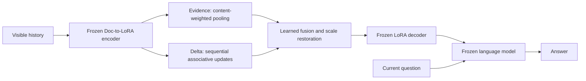

# DPPM: Dual-Path Parametric Memory for Personalized Language Models


**DPPM accumulates evidence and updates sequential memory to generate history-conditioned LoRA adapters.** The document-to-LoRA compiler, decoder, and language model remain frozen; answer cross-entropy trains **527,364 memory parameters**.



The question is used for answering, not for writing DPPM memory. Evidence bypasses repeated state updates; Delta preserves an order-sensitive channel. Scale restoration keeps the fused representation compatible with the frozen decoder.

## 📦 Installation

Run commands from this repository's root. Linux and a CUDA GPU are required for the Doc-to-LoRA integration; the memory modules and unit tests also run on CPU. The reference environment uses Python 3.10, PyTorch 2.6, Transformers 4.51.3, PEFT 0.15.2, and FlashAttention 2. Install a PyTorch build compatible with your CUDA installation first.

```bash
python -m venv .venv
source .venv/bin/activate
pip install torch==2.6.0
pip install -e '.[d2l]'
pip install flash-attn==2.7.4.post1 --no-build-isolation

mkdir -p third_party
git clone https://github.com/SakanaAI/doc-to-lora.git third_party/doc-to-lora
git -C third_party/doc-to-lora checkout baa85db4d5df9b29d618af432d6ebf28b3ad5a29
pip install --no-deps -e third_party/doc-to-lora
```

Upstream Doc-to-LoRA has optional training/serving dependencies that are not needed here. The `--no-deps` installation uses this repository's smaller dependency set. Set `attention: sdpa` in a local YAML to use PyTorch attention instead of FlashAttention; numerical reproduction was checked with FlashAttention. An 80 GB GPU is a conservative reference setup, not a measured minimum requirement.

## 🚀 Reproduce DPPM on PrefEval

### 1. Download the public compiler and benchmark

```bash
python - <<'PY'
from huggingface_hub import snapshot_download
snapshot_download(
    'SakanaAI/doc-to-lora',
    allow_patterns=['qwen_4b_d2l/checkpoint-20000/pytorch_model.bin'],
    local_dir='models/doc-to-lora',
)
PY
mkdir -p data
git clone https://github.com/amazon-science/PrefEval.git data/PrefEval
git -C data/PrefEval checkout 50795054b5ff5f418d2b768a331d71e480f93331
dppm prepare --dataset prefeval --source data/PrefEval --output data/prefeval
```

The base model `Qwen/Qwen3-4B-Instruct-2507` downloads through Hugging Face on first use. To use local weights, set `DPPM_BASE_MODEL` at runtime. The Qwen compiler's expected SHA-256 is `6438b46c828dd3b5f88f21add0f7f5cacc7994d47bf15eda266786a506044591`.

### 2. Compile visible histories and evaluate the included checkpoint

```bash
CUDA_VISIBLE_DEVICES=0 dppm cache \
  --config configs/qwen4b.yaml --data data/prefeval \
  --split test --output artifacts/qwen4b/prefeval

CUDA_VISIBLE_DEVICES=0 dppm evaluate \
  --config configs/qwen4b.yaml --data data/prefeval \
  --cache artifacts/qwen4b/prefeval --method dppm \
  --checkpoint checkpoints/qwen4b_prefeval_seed42.pt \
  --output runs/qwen4b/prefeval/dppm_seed42
```

This evaluates **all 1,620 held-out questions**, covering three preference forms and 10/70/300 intervening turns. It writes `predictions.jsonl`, `metrics.json`, configuration/data hashes, and a completion marker. Reusing the same command resumes completed questions only when its settings match.

Expected seed-42 accuracy: **87.78% (1,422 / 1,620)**. The paper's **86.79%** is the mean of five independently trained seeds, not the expected value of this checkpoint. See [release verification](docs/validation.md) for the actual clean-package rerun and its scope.

### 3. Train a memory from scratch

```bash
dppm cache --config configs/qwen4b.yaml --data data/prefeval \
  --split all --output artifacts/qwen4b/prefeval_all
dppm train --config configs/qwen4b.yaml --data data/prefeval \
  --cache artifacts/qwen4b/prefeval_all --method dppm --seed 42 \
  --output runs/train/qwen4b/prefeval/seed42
dppm evaluate --config configs/qwen4b.yaml --data data/prefeval \
  --cache artifacts/qwen4b/prefeval_all --method dppm \
  --checkpoint runs/train/qwen4b/prefeval/seed42/memory.pt \
  --output runs/eval/qwen4b/prefeval/seed42
```

Training uses five epochs, AdamW, learning rate 0.001, weight decay 0.01, gradient clipping 1.0, and one question per step. Use `--resume` to resume a saved optimizer/RNG state. Repeat with seeds **42, 43, 44, 45, 46** to estimate the paper's five-seed mean. This release implements the principal **CE** training recipe; exploratory distillation/RL objectives are not included.

## Backbones and checkpoints

| Config | Frozen base | Public compiler subdirectory |
|---|---|---|
| `configs/qwen4b.yaml` | `Qwen/Qwen3-4B-Instruct-2507` | `qwen_4b_d2l` |
| `configs/gemma2b.yaml` | `google/gemma-2-2b-it` | `gemma_2b_d2l` |
| `configs/mistral7b.yaml` | `mistralai/Mistral-7B-Instruct-v0.2` | `mistral_7b_d2l` |

Download the corresponding `checkpoint-20000/pytorch_model.bin` from `SakanaAI/doc-to-lora`, change `--config`, and build a **separate cache for each backbone**. Six seed-42 DPPM checkpoints are included: three backbones × two datasets. Their metadata and hashes are in [checkpoints/manifest.json](checkpoints/manifest.json). Backbone access/license requirements still apply.

Configure model IDs, paths, device, attention, external baseline sources, and training settings in YAML. Runtime overrides are `DPPM_BASE_MODEL`, `DPPM_COMPILER_CHECKPOINT`, `DPPM_D2L_SOURCE`, and `DPPM_DEVICE`; they are not embedded in exported weights. Paths in YAML are relative to the working directory. Keep machine-specific overrides in ignored `configs/local*.yaml` files.

## Datasets and metrics

| Dataset | Protocol | Train | Validation | Test |
|---|---|---:|---:|---:|
| PersonaMem-v2 | 32K histories; test users excluded from training/validation | 18,527 | 2,059 | 5,000 |
| PrefEval | 16 training topics / 4 held-out topics; 3 forms × 3 intervals | 7,380 | — | 1,620 |

For PersonaMem-v2, download the pinned public release and prepare it:

```bash
python - <<'PY'
from huggingface_hub import snapshot_download
snapshot_download('bowen-upenn/PersonaMem-v2', repo_type='dataset',
    revision='ed956dea41521fc4499acbc63f966e0fd3c053ba', local_dir='data/PersonaMem-v2')
PY
dppm prepare --dataset persona --source data/PersonaMem-v2 --output data/persona
```

**Overall** is micro accuracy over all test questions. Persona **Self** selects `who == self`; **Current** selects `updated == False`. PrefEval interval accuracies contain 540 questions each, so their equal-weight average equals Overall. The two-dataset average in the paper is the mean of the two Overall scores. Options are shuffled deterministically by question ID, and the label is moved with the correct answer.

Gold State is an annotation-based oracle reference and is passed only to its dedicated baseline. DPPM compilation consumes visible historical messages only. The preparer checks split counts and user separation; compiler caches are fingerprinted by model/compiler, tokenizer, templates, and segmentation settings. Histories are segmented with a 4,096-token budget and one-event overlap. Full-context answer inputs exceeding the model capacity fail explicitly; they are not silently truncated.

## Baseline interfaces

`dppm methods` lists available method names. All evaluators implement `score(row)` and select the highest-scoring legal option token.

| Family | CLI methods | Task training | Integration |
|---|---|---|---|
| References | `no_context`, `gold_state` | No | Local HF backbone |
| Text memory | `rolling_summary`, `rag`, `full_context` | No | Local HF backbone; BGE-M3 for RAG |
| Memory stores | `mem0`, `lightmem` | No | Official stores with local generation/embedding providers |
| Context-to-LoRA | `direct_d2l`, `plume` | No | Official Doc-to-LoRA / PLUME components |
| Native memory models | `delta_mem`, `metis` | No task training | Official pretrained releases; separate environment |
| Learned aggregation | `rpmem`, `evidence`, `delta`, `dppm` | CE | Frozen Doc-to-LoRA + memory module |
| Controls | `rpmem_matched`, `delta_matched`, `dppm_fixed`, `dppm_no_final_calibration`, `dppm_no_calibration` | CE | Parameter/component controls |

Here `rpmem` denotes the paper's recurrent-gate implementation within the common frozen compiler interface. `delta` is our associative path; **`delta_mem` is the separate public δ-mem baseline**. Controls need their own matching trained checkpoint. `rpmem_matched` and DPPM each have 527,364 parameters; the original gate has 524,800.

```bash
pip install -e '.[text]'
dppm evaluate --config configs/qwen4b.yaml --data data/prefeval \
  --method no_context --output runs/qwen4b/prefeval/no_context
```

See [baseline setup and limitations](docs/baselines.md) for Mem0, LightMem, PLUME, δ-mem, Metis-4B/9B/27B, and custom adapters. These optional wrappers are provided, but the release acceptance run covers **Qwen4B DPPM on full PrefEval**, not a fresh rerun of every baseline.

## Repository layout

```text
src/dppm/       memory modules, frozen backend, data, train/eval, baseline adapters
configs/        portable backbone and native-memory configs
checkpoints/    six DPPM memory-only checkpoints and checksums
docs/           protocol, baseline setup, release validation
scripts/        portability and prediction comparison utilities
tests/          CPU tests for memory and data contracts
```

Intermediate data, model downloads, stores, caches, and execution logs are ignored by Git. Evaluation sharding is supported with `--shard 0 --shards N` and separate output directories; `dppm merge` checks complete, nonoverlapping coverage. GPU selection should normally use `CUDA_VISIBLE_DEVICES` and leave `device: cuda:0` in YAML.

## Development and acknowledgments

```bash
pip install -e '.[dev]'
python -m unittest discover -s tests -v
ruff check src tests scripts
python scripts/check_portability.py
```

Code is MIT licensed. External models, benchmarks, and upstream projects retain their own licenses. See [third-party notices](THIRD_PARTY_NOTICES.md). Citation metadata is in [CITATION.cff](CITATION.cff); publication metadata can be added when available.
